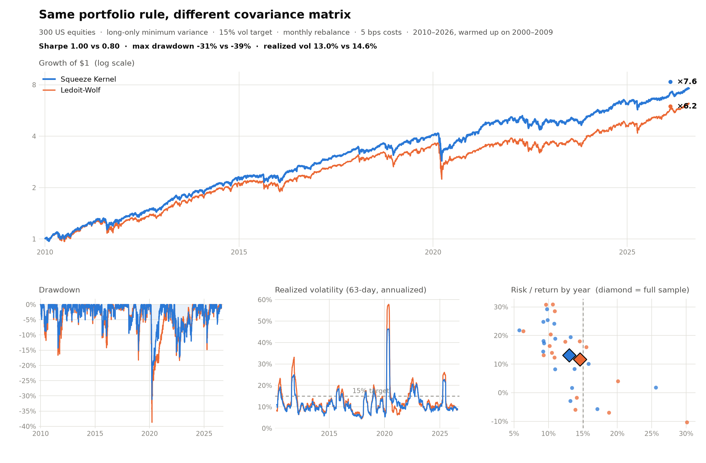

# Squeeze Kernel Covariance Estimator

[](https://github.com/r0k3/squeeze-kernel/actions/workflows/ci.yml)
[](https://pypi.org/project/squeeze-kernel/)
[](https://pypi.org/project/squeeze-kernel/)
[](LICENSE)

A **streaming covariance estimator for panels of financial returns** that learns fastest on the days that matter. One `O(n²)` update per period, positive semi-definite **by construction** at every step, missing values handled **natively**, and defaults that require no tuning. Only dependency: NumPy.

References: *"The Squeeze Kernel Covariance Estimator: Dual-Timescale Tracking with Adaptive Shrinkage"* (Kende, 2026) — [SSRN abstract 6455918](https://ssrn.com/abstract=6455918) — and its companion *"Cluster-Respecting Shrinkage for Streaming Covariance Estimation"* (Kende, 2026).

## Why

Every standard covariance estimator treats all trading days as equally informative. Markets don't work that way: **correlations reveal themselves when markets move; calm days are mostly noise.** The Squeeze Kernel weighs each day by the information it actually carries — quiet days barely count, dispersion shocks pass through in full — and runs volatility and correlation on separate clocks, so vol spikes never contaminate the correlation estimate. The result is a single streaming recursion that:

- **is PSD at every step, structurally** — never needs eigenvalue clipping, nearest-PSD projection, or a solver;
- **adapts fastest exactly when it matters** — a Fisher-information kernel up-weights high-dispersion (stress) days, when correlation regimes actually move;
- **regularises itself** — an adaptive equicorrelation shrinkage activates automatically as the asset count approaches the effective sample size, with a provable condition-number bound;
- **ingests missing values natively** — listings, delistings, and halts enter as `NaN`; no imputation or complete-case subsetting;
- **is fast** — a full 30-year daily pass takes ~0.75 s at n=100 and ~3.4 s at n=300 (single-threaded), 30–40× faster than rolling-window baselines at scale.

**The scoreboard.** On a 30-year S&P 500 panel (~7,600 out-of-sample days) the default single-scale estimator beats EWMA, Ledoit–Wolf, OAS, nonlinear shrinkage, RMT denoising, and the Gerber statistic on one-step density forecasts, and statistically ties DCC — the only two methods in the 90% model confidence set. The headline configuration (multi-scale correlation memory, `corr_half_lives=(43, 173, 693)`) goes further: it **leads every tested method at every universe size and the 90% model confidence set collapses to it alone**, with the margin confirmed out-of-time on an external industry panel. For large equity universes, the cluster shrinkage target (`shrinkage_target="cluster"`) adds a further large gain exactly where shrinkage binds: 25 NLL points at n=300.

Against the alternatives:

- **RiskMetrics / EWMA** — same one-recursion simplicity, but two clocks and information weighting: better forecasts at zero extra operational cost.
- **Ledoit–Wolf, nonlinear shrinkage, RMT denoising** — static snapshots refit from scratch on a rolling window each day; the Squeeze Kernel is genuinely dynamic, more accurate on the benchmark, and 30–40× faster at scale.
- **DCC-GARCH** — matched (single-scale) or beaten (multi-scale) without multi-stage likelihood fitting or the fragile news-impact coefficient; at n=300 DCC needs a multi-year warm-up before its forecasts stabilise and still trails by ~25 NLL.
- **Gerber statistic** — the Squeeze Kernel is a PSD-by-construction generalization of the same robust-comovement idea: no nearest-PSD repair step, and it wins the head-to-head.

## See the difference

Take a passive strategy any allocator would recognize: a long-only minimum-variance portfolio of 300 liquid US stocks, scaled to a 15% volatility target, rebalanced once a month, with 5 bps trading costs. Run it twice on identical data. The only thing that changes between the two runs is the covariance matrix that picks the weights and sets the exposure.

<picture>
  <source media="(prefers-color-scheme: dark)" srcset="examples/figures/vol_targeted_portfolio_dark.png">
  
</picture>

| Method | CAGR | Vol | Sharpe | MaxDD | Calmar | Vol-target RMSE |
|---|---|---|---|---|---|---|
| **Squeeze Kernel** | **13.1%** | **13.0%** | **1.00** | **-31.2%** | **0.42** | **6.47%** |
| Ledoit-Wolf (252d) | 11.7% | 14.6% | 0.80 | -38.7% | 0.30 | 7.51% |

You can regenerate this example from the repo alone. The returns panel ships as a parquet (daily returns for 300 US stocks, sourced from Yahoo Finance), and the script prints the table and redraws the figure:

```bash
pip install squeeze-kernel pandas pyarrow scikit-learn matplotlib
python examples/vol_targeted_portfolio.py    # ~2 minutes
```

The full protocol and data notes live in [`examples/vol_targeted_portfolio.py`](examples/vol_targeted_portfolio.py) and [`examples/data/build_equity_panel.py`](examples/data/build_equity_panel.py).

## Installation

```bash
pip install squeeze-kernel          # NumPy only
pip install "squeeze-kernel[full]"  # + SciPy (kappa calibration, chi² kernel)
```

## Quickstart

```python
import numpy as np
from squeeze_kernel import SqueezeKernelEstimator

# daily_returns: array of shape (T, n) — may contain NaN for missing assets
est = SqueezeKernelEstimator(n_assets=daily_returns.shape[1])

for r_t in daily_returns:          # stream one day at a time
    est.update(r_t)

cov  = est.get_cov()               # (n, n) covariance, PSD by construction
corr = est.get_corr()              # (n, n) correlation
```

That is the whole API for most uses. The defaults (`lambda_vol=0.98`, `lambda_corr=0.996`, `kappa=0.25`) are the paper-recommended settings for daily returns, selected by time-series cross-validation and robust across a 50× parameter sweep — deploy them as-is.

Batch mode, if you prefer the full path in one call:

```python
from squeeze_kernel import estimate_squeeze_cov

cov_path, corr_path, weights = estimate_squeeze_cov(daily_returns, with_weights=True)
# cov_path: (T, n, n) — the estimate after each day
```

A complete runnable walkthrough (streaming, missing data, batch) is in [`examples/quickstart.py`](examples/quickstart.py).

## Missing values

Pass `NaN` for any asset not observed on a given day — nothing else to do:

```python
r_t = np.array([0.004, np.nan, -0.011])   # asset 2 not trading today
est.update(r_t)                            # PSD preserved, no imputation
```

## Parameters

| Parameter | Default | Meaning |
|---|---|---|
| `lambda_vol` | `0.98` | volatility EWMA decay (half-life ≈ 34 days) |
| `lambda_corr` | `0.996` | correlation EWMA decay (half-life ≈ 173 days, T_eff ≈ 250) |
| `kappa` | `0.25` | Fisher kernel saturation; higher = stronger calm-day filtering |
| `shrinkage` | `"auto"` | adaptive equicorrelation shrinkage (`"none"` or a float to override) |
| `shrinkage_delta` | `0.10` | concentration threshold at which shrinkage activates |

Useful read-only state after each `update()`: `est.weight` (last kernel weight), `est.effective_sample_size` (kernel-weighted T_eff), `est.shrinkage_intensity` (current α).

To recalibrate `kappa` for a different asset class (requires the `full` extra):

```python
kappa = SqueezeKernelEstimator.calibrate_kappa(burn_in_returns, target_weight=0.6)
```

## Advanced options

All options are off by default; the defaults reproduce the published estimator exactly. Full derivations and benchmark tables are in the papers.

**Multi-scale correlation memory** (`corr_half_lives=(43, 173, 693)`): replaces the single correlation timescale with a ladder of EWMAs whose blend a sequential surprise detector tilts toward fast or slow memory as the evidence demands. This is the papers' headline configuration: it leads every tested method at every universe size, and the blend stays convex so PSD still holds by construction.

**Cluster shrinkage target** (`shrinkage_target="cluster"`): shrinks toward a target that respects the correlation matrix's own block structure instead of a single equicorrelation, with no clustering algorithm and zero added parameters. The best choice for large equity universes: worth 4 held-out NLL points at n=200 and 25 at n=300 on the benchmark.

```python
# recommended setup for a large equity universe:
est = SqueezeKernelEstimator(n_assets=300, corr_half_lives=(43, 173, 693),
                             shrinkage_target="cluster")
```

**OU volatility anchor** (`vol_anchor_phi=0.995`): mean-reverts each asset's variance forecast toward a slow per-asset anchor, giving a two-timescale volatility structure with a single parameter (deviation half-life ≈ ln 2/(1−φ) days). Worth 3–5 NLL points on the benchmark.

**Score-exact weighting** (`weight_statistic="mahalanobis"`, use with `kappa=1.0`): drives the kernel with the Mahalanobis surprise against the estimator's own correlation. Use it only in the moderate-concentration regime (`n / T_eff ≲ 0.5`).

**Score-driven memory** (`lambda_corr_fast=0.99`): lets stress days also shorten the correlation memory. Do not combine with the Mahalanobis option.

**New-listing usability gate** (`min_obs=60`): exposes a `usable_mask` property marking assets with at least `min_obs` observations, so deployments can exclude cold starts from scoring and optimization; the estimates themselves are unchanged.

**Alternative kernels**: pass `kernel_fn=kernel_exponential` or `kernel_chi2_cdf`, or any callable mapping to `[0, 1)`; the PSD guarantee holds for any such kernel.

## How it works

Three mechanisms in one recursion:

1. **Dual-timescale EWMA** — fast per-asset volatility (`lambda_vol`) is separated from slow correlation dynamics (`lambda_corr`), so variance shocks don't contaminate the correlation estimate.
2. **Fisher kernel weighting** — each day's standardized outer product enters with weight `w = d²/(d² + kappa)`, where `d²` is the mean squared standardized return: calm days contribute little, dispersion shocks contribute fully.
3. **Adaptive equicorrelation shrinkage** — `alpha = min(1, max(0, n/(2·S) − delta))` blends toward an equicorrelation target using the estimator's own kernel-weighted sample size `S`; it is a no-op at low dimension and provides provably bounded conditioning at high dimension.

The complete update is a natural-gradient step on the Gaussian log-likelihood, with the kernel weight acting as an adaptive Riemannian learning rate (paper, Appendix B).

## Development

```bash
uv sync --extra full --extra dev
uv run python -m pytest        # test suite
uv run python -m ruff check .  # lint
uv run mypy                      # strict type check (src/squeeze_kernel)
uv build                       # build sdist + wheel
```

## Citation

```bibtex
@article{kende2026squeeze,
  title  = {The Squeeze Kernel Covariance Estimator: Dual-Timescale Tracking with Adaptive Shrinkage},
  author = {Kende, Robert},
  year   = {2026},
  note   = {Available at SSRN: \url{https://ssrn.com/abstract=6455918}}
}
```

See also [`CITATION.cff`](CITATION.cff).

## License

MIT
